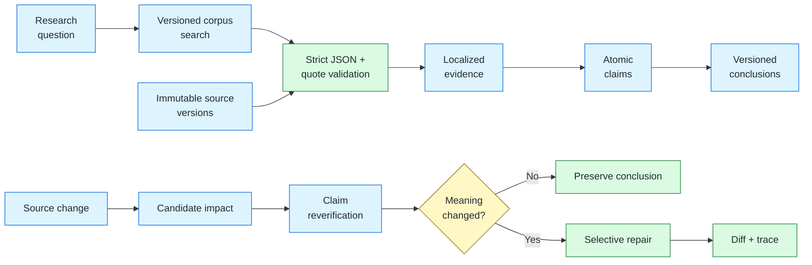

<div align="center">

# Veritas

### Keep research conclusions in sync with changing evidence.

**Veritas is an experimental evidence-evolution engine for long-running research systems.**

[](https://www.python.org/)


[Run the suite](#quick-start) · [Explore the project](#where-to-start) · [Understand the mechanism](#how-it-works)

</div>

---

Research agents are good at producing an answer once. They are much less prepared for what happens next:

> A source changes, a document is withdrawn, or a claim loses support. Which conclusions should be revisited—and which should remain untouched?

Veritas explores that problem in a deliberately small, deterministic environment. Give it a frozen research snapshot and a source change; it computes the affected subgraph, rechecks the relevant claims, repairs only conclusions whose meaning actually changed, and leaves an auditable trace.

## See it in one example

Suppose an SDK policy requires at least three retries:

```text
T0  API Reference: default retries = 3
    Conclusion: retry policy satisfies the requirement  ✓

T1  API Reference: default retries = 1
    ChangeEvent: revise API v1.0 → v1.1

Veritas:
    candidate claims       retry_supported, default_retries_3
    changed claim          default_retries_3: accepted → contradicted
    repaired conclusion    retry_policy_fit: pass → fail
    preserved conclusion   python_311_compatible
    recomputed             1 of 2 conclusions
```

The interesting part is not the final `fail`. It is that Veritas can explain **why this conclusion changed, why the Python conclusion did not, and which immutable evidence versions support both answers**.

## Quick start

Veritas uses only Python standard-library runtime dependencies and requires **Python 3.11+**. Check your interpreter first:

```bash
python --version   # must be >= 3.11
```

> On Windows, if plain `python` resolves to an older interpreter (e.g. Anaconda), use the launcher: `py -3.14 -m veritas.evaluation.suite_runner`.

```powershell
git clone https://github.com/Peter-Sherlock/Veritas.git
cd Veritas

$env:PYTHONPATH = "src"
$env:PYTHONDONTWRITEBYTECODE = "1"

# Run all five evidence-evolution scenarios (suite 2.0.0)
python -m veritas.evaluation.suite_runner `
  --manifest datasets/suites/p0-evolution-suite-2.json `
  --artifacts-root artifacts
```

Expected summary:

```json
{
  "critical_failure_count": 0,
  "p0_3_acceptance_candidate": true,
  "recompute_totals": {
    "selective_recomputed_conclusions": 4,
    "selective_total_conclusions": 11,
    "full_recomputed_conclusions": 11
  }
}
```

Run the test suite:

```powershell
python -m unittest discover -s tests -v
```

Run the frozen 30-question extraction calibration:

```powershell
python -m veritas.evaluation.extraction_runner `
  --benchmark datasets/extraction/httpx-m1-2c/benchmark.json `
  --fixtures datasets/extraction/httpx-m1-2c/fixtures.json `
  --corpus-root datasets/corpus/httpx-docs `
  --assert-pass
```

Run the same benchmark against a live provider (M1-2C, requires an API key):

```powershell
$env:VERITAS_LLM_API_KEY = "<your DeepSeek key>"
python -m veritas.evaluation.extraction_runner `
  --provider live `
  --model deepseek-v4-flash `
  --benchmark datasets/extraction/httpx-m1-2c/benchmark.json `
  --corpus-root datasets/corpus/httpx-docs `
  --record-out artifacts/extraction/live/responses-recording.json `
  --output artifacts/extraction/live/summary-live.json
```

Every real exchange is recorded to `--record-out` and can be replayed deterministically afterwards, and every case's contract-valid candidates are committed transactionally to the SQLite store given by `--store-out`; the fixture benchmark above is untouched by live runs. Progress streams per case to stderr (`[live] 5/30 EX-005 fail requests=15 ...`) and the recording file is rewritten after every case, so an interrupted run keeps all completed exchanges. The full 30-question live run makes ~90 sequential API calls and takes several minutes.

Research sessions (M1-3) run through the runtime CLI — the same command resumes an interrupted session and is safe to rerun after completion:

```powershell
$env:VERITAS_LLM_API_KEY = "<your DeepSeek key>"
python -m veritas.runtime `
  --spec artifacts/runtime/httpx-session-m1-3b/session-spec.json `
  --corpus-root datasets/corpus/httpx-docs `
  --runtime-store artifacts/runtime/live/runtime.db `
  --candidates-out artifacts/runtime/live/candidates.db `
  --provider live `
  --record-out artifacts/runtime/live/responses-recording.json `
  --output artifacts/runtime/live/session-summary.json
```

Linux and macOS users can replace the environment setup with:

```bash
export PYTHONPATH=src
export PYTHONDONTWRITEBYTECODE=1
```

## Where to start

Choose the path that matches what you want to explore:

| I want to… | Start here |
| --- | --- |
| Run a complete experiment | [`suite_runner.py`](src/veritas/evaluation/suite_runner.py) and the [suite manifest](datasets/suites/p0-evolution-suite-2.json) |
| Read a small input fixture | [GS-002: redundant-source retraction](datasets/scenarios/GS-002/scenario.json) |
| Follow one decision step by step | [GS-003 trace](artifacts/GS-003/run-046dcc6b4ed54440/trace.json) |
| See a conclusion change | [GS-003 conclusion diff](artifacts/GS-003/run-046dcc6b4ed54440/conclusion_diff.json) |
| Understand impact propagation | [`impact.py`](src/veritas/invalidation/impact.py) and [`graph.py`](src/veritas/evidence/graph.py) |
| Understand selective repair | [`repair.py`](src/veritas/invalidation/repair.py) |
| Inspect failure-detector calibration | [`test_failure_taxonomy.py`](tests/unit/test_failure_taxonomy.py) |
| Inspect persistence and current-view semantics | [`sqlite.py`](src/veritas/storage/sqlite.py) |
| Explore the frozen HTTPX corpus | [corpus manifest](datasets/corpus/httpx-docs/manifest.json) and [`LocalCorpusProvider`](src/veritas/search/local_corpus.py) |
| Inspect the LLM boundary | [`LLMProvider`, fixture replay and compatible client](src/veritas/providers/llm.py) |
| Follow retrieval into grounded candidates | [strict extraction pipeline](src/veritas/extraction/pipeline.py) |
| See how sessions checkpoint and respect budgets | [runtime store and engine](src/veritas/runtime/) |
| Run a resumable research session | [runtime CLI](src/veritas/runtime/cli.py) and the [frozen live session](artifacts/runtime/httpx-session-m1-3b/session-summary.json) |
| Inspect the 30-question extraction benchmark | [benchmark](datasets/extraction/httpx-m1-2c/benchmark.json) and [summary](artifacts/extraction/httpx-initial-extraction-3.0.0/summary.json) |
| Inspect the real-provider calibration baselines | [v2 contract](artifacts/extraction/httpx-initial-extraction-2.0.0-deepseek-v4-flash/) and [v3 contract](artifacts/extraction/httpx-initial-extraction-3.0.0-deepseek-v4-flash/) (DeepSeek V4-Flash) |
| See how the fixture benchmark is generated | [`build_extraction_v2_fixtures.py`](scripts/build_extraction_v2_fixtures.py) |
| Read the full technical specification | [Technical implementation](docs/TECHNICAL_IMPLEMENTATION.md) |
| Understand design decisions and boundaries | [Project structure and design](docs/PROJECT_STRUCTURE.md) |

## How it works



The execution loop is intentionally explicit:

1. Load and hash a scenario snapshot.
2. Record an idempotent `ChangeEvent` such as `revise` or `retract`.
3. Traverse the dependency graph to find candidate claims and conclusions.
4. Re-evaluate candidate claims against the current evidence view.
5. Recompute only conclusions that depend on claims whose semantic state changed.
6. Persist new versions, the untouched set, a conclusion diff, metrics, and a replayable trace.

Two boundaries matter:

- **Candidate impact is not invalidation.** A changed source only tells Veritas what to check.
- **A recheck does not imply a rewrite.** If redundant evidence preserves a claim, no new conclusion version is created.

## Included experiments

| Scenario | Question being tested | Result |
| --- | --- | --- |
| **GS-001 — Revision** | Can a changed retry default update only the retry-policy branch? | 1 of 2 conclusions recomputed |
| **GS-002 — Retraction** | Can a source disappear while redundant evidence keeps the conclusion valid? | 0 of 2 conclusions recomputed |
| **GS-003 — Branch isolation** | Can Python compatibility change without touching the retry branch? | 1 of 2 conclusions recomputed |
| **GS-004 — Expiry** | Does an expired time-limited source demote a conclusion to `unknown` instead of `fail`? | 1 of 3 conclusions recomputed |
| **GS-005 — Multi-source conflict** | Does an independent contradicting source produce a preserved `conflict` instead of silent arbitration? | 1 of 2 conclusions recomputed |

Across the frozen suite (v2.0.0), selective execution recomputes **4 of 11** conclusions; the full-recompute baseline evaluates **11 of 11**. Both produce identical final outcomes in all five scenarios.

Open the [machine-readable suite summary](artifacts/suites/p0-evolution-suite-2.0.0/summary.json) for per-scenario metrics and failure records. The original three-scenario suite remains frozen at [v1.0.0](artifacts/suites/p0-evolution-suite-1.0.0/summary.json).

## What a run produces

```text
artifacts/<scenario>/<run-id>/
├── candidate_impact.json          # what must be checked
├── confirmed_invalidations.json   # what actually changed
├── conclusion_diff.json           # old vs. new conclusion
├── trace.json                     # ordered reasoning events
└── metrics.json                   # ground-truth and baseline comparison
```

Every JSON artifact carries a SHA-256 hash of its canonical payload. The suite verifies artifact completeness and detects missing or modified output.

## Project map

```text
src/veritas/
├── domain/          immutable entities and validation
├── evidence/        dependency graph and deterministic rules
├── invalidation/    impact analysis and selective repair
├── storage/         SQLite persistence, lineage and current views
├── extraction/      strict JSON, quote alignment and domain candidates
├── evaluation/      evolution suites and extraction calibration
├── runtime/         session state, work queue, checkpoints and budget
├── search/          retrieval protocol and frozen-corpus TF-IDF baseline
└── providers/       LLM protocol, fixture replay and compatible client

datasets/
├── scenarios/       executable fixtures plus ground truth
├── suites/          explicit, version-locked suite manifests
├── corpus/          versioned HTTPX documentation snapshots
└── extraction/      30 questions (v3.0.0), gold assertions and frozen responses

tests/               unit invariants and end-to-end scenarios
docs/                detailed implementation and design decisions
```

## Try changing the experiment

A scenario is a self-contained JSON document with:

- a `T0` research snapshot;
- one source `change`;
- the expected `ground_truth` sets and outcomes;
- a pinned scenario version and rule version.

Start by copying [GS-002](datasets/scenarios/GS-002/scenario.json), which has the smallest semantic change: one source is retracted, one claim is rechecked, and no conclusion is rewritten. Run it with:

```powershell
$env:PYTHONPATH = "src"
python -m veritas.evaluation.runner `
  --scenario path/to/your/scenario.json `
  --database artifacts/experiment/veritas.sqlite3 `
  --artifacts-root artifacts
```

Keep experimental fixtures outside the frozen suite until their ground truth has been reviewed. The suite never discovers scenarios by directory scan; inclusion is always explicit.

## Project status

Veritas has closed **M1-2: extraction calibration** with a passed gate review and has **completed M1-3: research runtime** (engine + CLI + a real live session). The deterministic fixture baseline, two real-provider recordings, a contract revision that eliminated all integrity failures, transactional candidate persistence, the M1-2 gate review, the runtime engine (session state, work queue, checkpoints, request budget), and a spec-driven CLI driving real DeepSeek sessions are complete; the remaining quality gap is semantic paraphrasing.

- Python 3.11+, SQLite, no third-party runtime dependencies
- 141 automated tests on Python 3.11 and 3.14
- five frozen scenarios covering revision, retraction, branch isolation, expiry, and multi-source conflict
- provenance, snapshot-drift, idempotency, replay, and artifact-integrity checks
- selective execution matches full recomputation in all scenarios while evaluating 4 of 11 conclusions instead of 11 of 11
- replaceable search/LLM protocols and a local HTTPX corpus with 10 documents and 48 version snapshots
- canonical LF corpus hashes, with CI covering both Python versions and both frozen suite manifests
- strict extraction validation: exact JSON schema, unique verbatim citations and deterministic Evidence/Claim/edge IDs
- canonical keys are derived by the deterministic layer from the statement (schema `evidence-assertion-2`) — the model proposes content only
- contract-valid candidates persist transactionally to SQLite (`--store-out`) with content-hash identity, cross-run dedup and conflict queries; the store never merges or overwrites
- a frozen 30-question fixture benchmark (v3.0.0, a superset of the 10-question M1-2A set): 30/30 cases, exact assertion precision/recall 1.0, citation alignment 1.0, including multi-assertion, contradicts and as_of version-view cases
- an extraction failure taxonomy (EX01–EX05) with critical/major severity, each class independently triggered by negative calibration
- retrieval hit@3 is 1.0 but MRR is 0.7222 on the expanded set; correct sources beyond rank one are kept as honest retrieval facts

Gate P0 was reviewed on 2026-08-29 and **passed with conditions** (see [D-021](docs/PROJECT_STRUCTURE.md)): the mechanism is validated on controlled graphs; LLM extraction must be calibrated against deterministic fixtures in M1, and no cost claim may be extrapolated from the 4/11 ratio without a scaled benchmark.

**M1-2B** added an extraction failure taxonomy: EX01 retrieval miss, EX02 contract rejection, and EX05 fixture drift are integrity failures, while EX03 citation rejection and EX04 assertion mismatch are quality gaps. **M1-2B2** expanded the frozen benchmark to 30 questions (multi-assertion, contradicts, and two as_of version-view cases from real HTTPX history). **M1-2C-pre** wired the live-provider path; **M1-2C** recorded DeepSeek V4-Flash against the frozen prompts: 0/30 exact match with 9 contract rejections (model-proposed keys with illegal characters), 9 citation rejections, and 12 assertion mismatches at ≈0.42 CNY — pinning exact-statement matching as an unattainable quality bar (D-030). **M1-2C2** acted on that finding (D-031): the model no longer proposes canonical keys — the deterministic layer derives them from statements — and the scoring identity dropped to key level. The re-run under contract v2 eliminated **all 9 integrity failures** (critical = 0), cut citation rejections from 9 to 4 (citation alignment 0.4 → 0.8667), and left semantic paraphrasing as the dominant, honestly-measured quality gap (26/30 cases). **M1-2D** persisted the candidates (D-032): every contract-valid assertion lands in a dedicated transactional SQLite store keyed by (source version, canonical key, content hash), exact repeats dedup idempotently across runs, and disagreements are surfaced, never merged — the paraphrase noise is now frozen evidence (quickstart@0.28.1 holds 15 candidates with 15 distinct keys, neither EX-014 gold key among them). **Gate M1-2** verified all three exit conditions and passed the stage with three carried-forward items (D-033): M1-3 must be designed against the measured real baseline (0/30, persisted paraphrase noise), candidate aggregation stays expose-only until an evidence-based merge exists, and model-capability claims require a second run. **M1-3A** delivered that runtime engine (D-034): a queue of research questions runs through the calibrated extraction pipeline with a per-item transactional checkpoint in its own SQLite session store; resuming after a simulated crash skips finished items and converges to the same terminal state as an uninterrupted run; the request budget is reserved before each provider call so a crash can underspend but never overspend, and exhausting it is a clean stop that a raised budget resumes; contract rejections are terminal, recorded with their error code. **M1-3B** wired it to the command line (D-035): sessions are defined by a spec JSON, `--provider live` records every exchange (saved per item, crash-safe) while `--provider replay` re-runs a recording deterministically, rerunning the same command resumes an interrupted session or re-prints a completed one, and a real 3-question DeepSeek session (7 requests: one completed item, two citation rejections blocked at the contract boundary) is frozen in `artifacts/runtime/httpx-session-m1-3b/` and pinned by replay tests.

> [!WARNING]
> This repository does not yet perform web search, autonomous planning, or production-scale concurrent execution. The 30/30 extraction result is deterministic fixture replay, not evidence of real-model quality; the two measured live baselines (DeepSeek V4-Flash, one run per contract) are 0/30, with integrity failures eliminated by construction under contract v2 but semantic paraphrasing (26/30) unsolved.

## Further reading

- [Technical implementation](docs/TECHNICAL_IMPLEMENTATION.md) — models, algorithms, ground truth, metrics, and verified behavior
- [Project structure and design](docs/PROJECT_STRUCTURE.md) — boundaries, trade-offs, decisions, and stage gates
- [Initial design](<Veritas-Initial-Design(2).md>) — the broader Long-Horizon Research Agent direction

---

<div align="center">

**Veritas remembers why a conclusion was true—and knows what to revisit when the evidence changes.**

</div>
