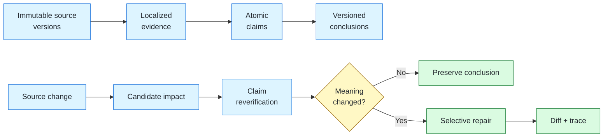

<div align="center">

# Veritas

### Keep research conclusions in sync with changing evidence.

**Veritas is an experimental evidence-evolution engine for long-running research systems.**

[](https://www.python.org/)


[Run the suite](#quick-start) · [Explore the project](#where-to-start) · [Understand the mechanism](#how-it-works)

</div>

---

Research agents are good at producing an answer once. They are much less prepared for what happens next:

> A source changes, a document is withdrawn, or a claim loses support. Which conclusions should be revisited—and which should remain untouched?

Veritas explores that problem in a deliberately small, deterministic environment. Give it a frozen research snapshot and a source change; it computes the affected subgraph, rechecks the relevant claims, repairs only conclusions whose meaning actually changed, and leaves an auditable trace.

## See it in one example

Suppose an SDK policy requires at least three retries:

```text
T0  API Reference: default retries = 3
    Conclusion: retry policy satisfies the requirement  ✓

T1  API Reference: default retries = 1
    ChangeEvent: revise API v1.0 → v1.1

Veritas:
    candidate claims       retry_supported, default_retries_3
    changed claim          default_retries_3: accepted → contradicted
    repaired conclusion    retry_policy_fit: pass → fail
    preserved conclusion   python_311_compatible
    recomputed             1 of 2 conclusions
```

The interesting part is not the final `fail`. It is that Veritas can explain **why this conclusion changed, why the Python conclusion did not, and which immutable evidence versions support both answers**.

## Quick start

Veritas uses only Python standard-library runtime dependencies.

```powershell
git clone https://github.com/Peter-Sherlock/Veritas.git
cd Veritas

$env:PYTHONPATH = "src"
$env:PYTHONDONTWRITEBYTECODE = "1"

# Run all three evidence-evolution scenarios
python -m veritas.evaluation.suite_runner
```

Expected summary:

```json
{
  "critical_failure_count": 0,
  "p0_2b_acceptance_candidate": true,
  "recompute_totals": {
    "selective_recomputed_conclusions": 2,
    "selective_total_conclusions": 6,
    "full_recomputed_conclusions": 6
  }
}
```

Run the test suite:

```powershell
python -m unittest discover -s tests -v
```

Linux and macOS users can replace the environment setup with:

```bash
export PYTHONPATH=src
export PYTHONDONTWRITEBYTECODE=1
```

## Where to start

Choose the path that matches what you want to explore:

| I want to… | Start here |
| --- | --- |
| Run a complete experiment | [`suite_runner.py`](src/veritas/evaluation/suite_runner.py) and the [suite manifest](datasets/suites/p0-evolution-suite.json) |
| Read a small input fixture | [GS-002: redundant-source retraction](datasets/scenarios/GS-002/scenario.json) |
| Follow one decision step by step | [GS-003 trace](artifacts/GS-003/run-046dcc6b4ed54440/trace.json) |
| See a conclusion change | [GS-003 conclusion diff](artifacts/GS-003/run-046dcc6b4ed54440/conclusion_diff.json) |
| Understand impact propagation | [`impact.py`](src/veritas/invalidation/impact.py) and [`graph.py`](src/veritas/evidence/graph.py) |
| Understand selective repair | [`repair.py`](src/veritas/invalidation/repair.py) |
| Inspect persistence and current-view semantics | [`sqlite.py`](src/veritas/storage/sqlite.py) |
| Read the full technical specification | [Technical implementation](docs/TECHNICAL_IMPLEMENTATION.md) |
| Understand design decisions and boundaries | [Project structure and design](docs/PROJECT_STRUCTURE.md) |

## How it works



The execution loop is intentionally explicit:

1. Load and hash a scenario snapshot.
2. Record an idempotent `ChangeEvent` such as `revise` or `retract`.
3. Traverse the dependency graph to find candidate claims and conclusions.
4. Re-evaluate candidate claims against the current evidence view.
5. Recompute only conclusions that depend on claims whose semantic state changed.
6. Persist new versions, the untouched set, a conclusion diff, metrics, and a replayable trace.

Two boundaries matter:

- **Candidate impact is not invalidation.** A changed source only tells Veritas what to check.
- **A recheck does not imply a rewrite.** If redundant evidence preserves a claim, no new conclusion version is created.

## Included experiments

| Scenario | Question being tested | Result |
| --- | --- | --- |
| **GS-001 — Revision** | Can a changed retry default update only the retry-policy branch? | 1 of 2 conclusions recomputed |
| **GS-002 — Retraction** | Can a source disappear while redundant evidence keeps the conclusion valid? | 0 of 2 conclusions recomputed |
| **GS-003 — Branch isolation** | Can Python compatibility change without touching the retry branch? | 1 of 2 conclusions recomputed |

Across the frozen suite, selective execution recomputes **2 of 6** conclusions; the full-recompute baseline evaluates **6 of 6**. Both produce identical final outcomes in all three scenarios.

Open the [machine-readable suite summary](artifacts/suites/p0-evolution-suite-1.0.0/summary.json) for per-scenario metrics and failure records.

## What a run produces

```text
artifacts/<scenario>/<run-id>/
├── candidate_impact.json          # what must be checked
├── confirmed_invalidations.json   # what actually changed
├── conclusion_diff.json           # old vs. new conclusion
├── trace.json                     # ordered reasoning events
└── metrics.json                   # ground-truth and baseline comparison
```

Every JSON artifact carries a SHA-256 hash of its canonical payload. The suite verifies artifact completeness and detects missing or modified output.

## Project map

```text
src/veritas/
├── domain/          immutable entities and validation
├── evidence/        dependency graph and deterministic rules
├── invalidation/    impact analysis and selective repair
├── storage/         SQLite persistence, lineage and current views
└── evaluation/      scenarios, metrics, artifacts and suite runner

datasets/
├── scenarios/       executable fixtures plus ground truth
└── suites/          explicit, version-locked suite manifests

tests/               unit invariants and end-to-end scenarios
docs/                detailed implementation and design decisions
```

## Try changing the experiment

A scenario is a self-contained JSON document with:

- a `T0` research snapshot;
- one source `change`;
- the expected `ground_truth` sets and outcomes;
- a pinned scenario version and rule version.

Start by copying [GS-002](datasets/scenarios/GS-002/scenario.json), which has the smallest semantic change: one source is retracted, one claim is rechecked, and no conclusion is rewritten. Run it with:

```powershell
$env:PYTHONPATH = "src"
python -m veritas.evaluation.runner `
  --scenario path/to/your/scenario.json `
  --database artifacts/experiment/veritas.sqlite3 `
  --artifacts-root artifacts
```

Keep experimental fixtures outside the frozen suite until their ground truth has been reviewed. The suite never discovers scenarios by directory scan; inclusion is always explicit.

## Project status

Veritas is currently at **P0-2B: deterministic mechanism verified**.

- Python 3.11+, SQLite, no third-party runtime dependencies
- 24 automated tests
- three frozen scenarios covering revision, retraction, and branch isolation
- provenance, snapshot-drift, idempotency, replay, and artifact-integrity checks

The next step is P0-2C: a formal failure and coverage analysis before deciding Gate P0.

> [!WARNING]
> This repository does not yet perform web search, LLM extraction, autonomous planning, or production-scale concurrent execution. The current numbers come from small controlled graphs and should not be treated as real-world cost estimates.

## Further reading

- [Technical implementation](docs/TECHNICAL_IMPLEMENTATION.md) — models, algorithms, ground truth, metrics, and verified behavior
- [Project structure and design](docs/PROJECT_STRUCTURE.md) — boundaries, trade-offs, decisions, and stage gates
- [Initial design](<Veritas-Initial-Design(2).md>) — the broader Long-Horizon Research Agent direction

---

<div align="center">

**Veritas remembers why a conclusion was true—and knows what to revisit when the evidence changes.**

</div>
