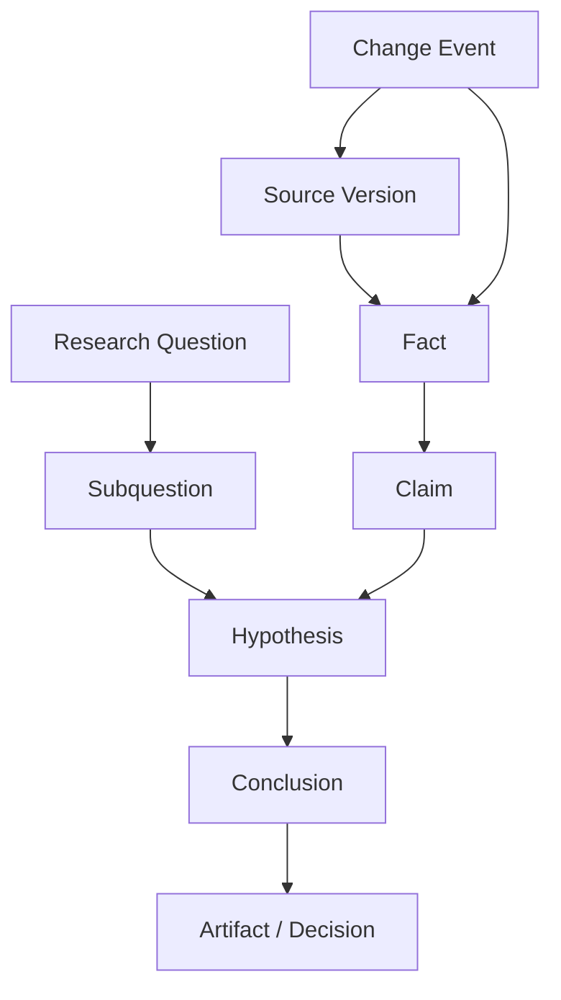
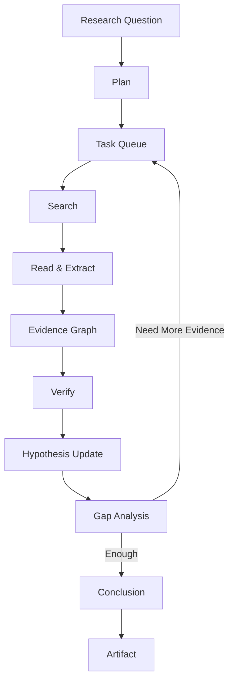
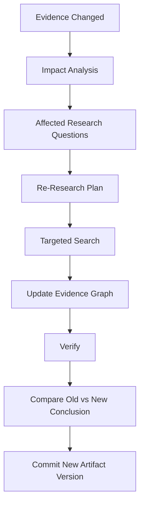

# Veritas 初期项目设计文档

> **副标题：** 面向长期研究任务的 Provenance-native Long-Horizon Research Agent  
> **状态：** Draft v0.2  
> **日期：** 2026-08-26  
> **目标形态：** 可运行 Long-Horizon Deep Research Agent + Evidence Graph + Persistent Research State + Selective Re-Research + 可复现实验 + GitHub 技术叙事

## 1. 一句话定位

Veritas 是一个面向长期研究任务的 Agent：它不仅能够进行多轮搜索、阅读、证据整合和报告生成，还会把研究过程中的来源、事实、假设、结论、决策和产物保存为可追踪的证据依赖图。

当外部证据被修订、撤回、过期或出现冲突时，Veritas 能定位哪些历史结论已经受影响，只重新研究必要部分，并解释“为什么这次结论发生了变化”。

它解决的不是：

> 如何做一次 Deep Research？

而是：

> 如何让一次研究变成一个可以持续数周、数月甚至数年的 Living Research Process？

## 2. 要解决的问题

当前多数 Deep Research 系统擅长：

```text
Question
  ↓
Plan
  ↓
Search
  ↓
Read
  ↓
Synthesize
  ↓
Report
```

但通常存在三个问题。

### 2.1 研究结束后状态丢失

下一次同主题研究：

- 重新搜索；
- 重新读取；
- 重新推理；
- 很难知道哪些结论已经证明过；
- 很难知道哪些来源曾经被排除。

### 2.2 外部世界发生变化

现实中的研究对象会变化：

- API 文档更新；
- 法规修订；
- 公司财报发布；
- 论文撤回；
- 产品价格变化；
- 新实验推翻旧结果；
- 新闻事件改变判断。

如果历史报告引用的证据已经失效，普通 Deep Research 不会自动知道：

> 哪些段落、结论、建议和决策现在应该重新研究？

### 2.3 长周期研究成本失控

每次变化都从头研究，会造成：

- 大量重复搜索；
- Token浪费；
- 无法解释新旧结论差异；
- 研究过程不可持续。

Veritas 的核心问题因此定义为：

> Long-Horizon Research 如何拥有持久状态、证据 provenance、依赖关系和最小范围重研究能力？

## 3. 核心研究假设

> 与一次性 Deep Research、普通向量 RAG、Recency-only RAG 相比，显式维护 Research State 与 Evidence Dependency Graph，并在证据变化后执行 Selective Re-Research，可以降低过时结论率、提高受影响结论识别率与修复成功率，同时减少重复搜索和重算成本。

首版必须通过实验验证，而不是预设结论成立。

## 4. 为什么它不是“又一个 Deep Research Agent”

Veritas 的独有贡献不在于“会搜索网页”。

| 独有资产 | 作用 |
| --- | --- |
| Research State | 持久保存研究目标、子问题、假设、未决问题和结论 |
| Versioned Evidence Store | 保存来源版本、发布时间、有效时间和可信度 |
| Evidence Graph | 连接 Source → Fact → Claim → Hypothesis → Conclusion → Artifact |
| Research Trace | 保存每轮搜索、阅读、排除、矛盾和重规划 |
| Change Event Log | 记录 revise / retract / expire / conflict / supersede |
| Selective Re-Research Engine | 只重新搜索和推理受影响的研究子图 |
| Citation & Entailment Verifier | 验证引用是否真的支持对应主张 |
| Evolution Benchmark | 测试研究系统面对外部变化后的长期一致性 |

基础模型变强会提升搜索、总结和推理能力，但不会自动提供上述持久状态与可验证依赖关系。

## 5. 目标用户与首个研究场景

### 5.1 长期目标用户

- 技术研究与架构决策；
- AI / 软件行业竞争研究；
- 政策与规范跟踪；
- 产品 / 市场情报；
- 学术证据综述；
- 长期尽调；
- 需要持续更新的研究报告。

### 5.2 MVP 场景

首版使用：

> **持续变化的软件技术与 AI 工程文档研究**

原因：

- 来源版本可获取；
- 更新事件明确；
- 技术事实可程序化验证；
- 适合构造 versioned ground truth；
- 不依赖模糊主观判断。

输入包括：

- API 文档；
- SDK 文档；
- release notes；
- migration guides；
- benchmark reports；
- 技术博客；
- 受控模拟网页。

任务包括：

- 比较两个版本兼容性；
- 形成架构决策；
- 调研某 Agent 框架能力；
- 生成迁移建议；
- 在新版本发布后更新历史结论。

## 6. 非目标

MVP 明确不做：

- 通用搜索引擎；
- 每天自动抓完整互联网；
- 新闻聚合器；
- 纯聊天机器人；
- 单纯“带引用的 RAG”；
- 多 Agent 角色扮演；
- 大规模爬虫基础设施；
- 自动相信所有网页；
- 训练基础模型；
- 把所有知识都放进一个向量库后称为长期记忆；
- 用“自我进化”替代可验证更新机制。

## 7. 核心概念模型



核心实体：

| 实体 | 说明 |
| --- | --- |
| ResearchProject | 一个长期研究主题 |
| ResearchQuestion | 主问题 |
| SubQuestion | 可执行子问题 |
| Hypothesis | 当前可被支持或反驳的假设 |
| SourceVersion | 某来源在某版本的不可变快照 |
| Fact | 带有效时间和证据跨度的结构化事实 |
| Claim | Agent 在推理中使用的主张 |
| Conclusion | 一组证据支撑下的当前结论 |
| Artifact | 报告、ADR、建议、比较表 |
| DependencyEdge | supports / contradicts / derived_from / supersedes |
| ChangeEvent | revise / retract / expire / conflict / supersede |
| ResearchJob | 一次搜索、阅读、验证或重研究任务 |

## 8. Research State

```python
class ResearchState(BaseModel):
    project_id: str
    main_question: str
    subquestions: list[str]
    active_hypotheses: list[str]
    resolved_questions: list[str]
    unresolved_questions: list[str]
    evidence_gaps: list[str]
    active_conclusions: list[str]
    budget_remaining: float
    last_updated_at: datetime
```

Research State 必须独立于 LLM context window。

它允许：

```text
Run #1
完成 60%
  ↓
Checkpoint
  ↓
两天后恢复
  ↓
继续未完成子问题
```

而不是把完整历史无限塞进 prompt。

## 9. 三种时间

Veritas 必须区分：

- **Event Time**：系统什么时候收到变化；
- **Valid Time**：这个事实在现实中什么时候成立；
- **Reasoning Time**：系统什么时候基于这些证据形成结论。

例如：

```text
2026-08-20 收到一份 2026-07-01 发布的旧文档
```

不能把它误认为：

> 2026-08-20 才开始有效的新事实。

## 10. Long-Horizon Research Loop



每轮：

1. 将主问题分解成子问题；
2. 建立研究计划；
3. 给每个子问题分配预算；
4. 搜索候选来源；
5. 排序与去重；
6. 阅读并抽取事实与引用跨度；
7. 更新 Evidence Graph；
8. 检测支持、反驳和冲突；
9. 更新 hypothesis confidence；
10. 找出 evidence gap；
11. 决定是否继续搜索或结束；
12. 生成有 provenance 的结论；
13. 持久化 Research State。

## 11. Search & Evidence Pipeline

```text
Query generation
      ↓
Search providers
      ↓
URL normalization
      ↓
Deduplication
      ↓
Source quality ranking
      ↓
Fetch / parse
      ↓
Fact extraction
      ↓
Citation span alignment
      ↓
Evidence graph
```

首版允许：

- Web Search Adapter；
- Local Versioned Corpus Adapter；
- GitHub / Documentation Adapter；
- Paper Search Adapter（后续）。

搜索层与推理层必须可替换。

## 12. Dynamic Replanning

Veritas 不使用固定一次性 plan。

当出现以下情况时重新规划：

- 某 hypothesis 被反驳；
- 关键证据质量低；
- 多个来源矛盾；
- budget 即将耗尽；
- 新证据引入新子问题；
- 来源版本变化。

```python
class ResearchDecision(BaseModel):
    next_action: Literal[
        "search_more",
        "read_source",
        "verify_claim",
        "split_question",
        "close_question",
        "request_human"
    ]
    target_id: str
    reason_refs: list[str]
    expected_information_gain: float
    estimated_cost: float
```

## 13. Evidence Graph

节点：

```text
SourceVersion
Fact
Claim
Hypothesis
Conclusion
Decision
Artifact
```

边：

```text
supports
contradicts
derived_from
depends_on
supersedes
invalidates
```

例如：

```text
SDK Docs v1.4
   ↓ supports
Fact A
   ↓ supports
Claim B
   ↓ supports
Conclusion C
   ↓ used_by
Migration Plan D
```

当 `SDK Docs v1.4` 被 `v1.5` 替代后：

```text
Change Event
   ↓
Impact Analysis
   ↓
Fact A?
   ↓
Claim B?
   ↓
Conclusion C?
   ↓
Plan D?
```

只有受影响节点进入重研究队列。

## 14. Selective Re-Research Loop



步骤：

1. 检测来源版本变化；
2. 创建 ChangeEvent；
3. 沿 dependency edges 传播；
4. 找出受影响 hypothesis / conclusion / artifact；
5. 为每个受影响区域重新生成 query；
6. 执行 targeted search；
7. 更新证据；
8. 重算必要结论；
9. 与旧版本比较；
10. 生成 Change Explanation；
11. 保留旧版本和完整 lineage。

## 15. Change Explanation

用户必须可以问：

> 为什么你现在的结论与上个月不同？

系统返回结构化 diff：

```text
Old Conclusion:
Framework A supports feature X.

Changed Evidence:
Docs v2.1 removed X and marked API as deprecated.

Affected Claims:
C12, C15

New Research:
Official migration guide + release notes

New Conclusion:
Framework A no longer supports X directly.

Impact:
Architecture Decision ADR-07 should be revised.
```

这部分是 Veritas 与普通 Deep Research 的关键差异。

## 16. Context Management

不能无限把历史研究塞入 context。

采用分层上下文：

```text
Global Research State
        +
Current Subquestion
        +
Relevant Evidence Subgraph
        +
Recent Trace
        +
Open Contradictions
```

需要比较：

- full-history prompt；
- summary memory；
- evidence-subgraph context；
- hybrid context。

## 17. 系统架构

| 模块 | 职责 | MVP |
| --- | --- | --- |
| Research Orchestrator | 长周期任务状态机 | Python |
| Planner | 问题分解与重规划 | Structured LLM |
| Task Queue | 子问题 / 搜索 / 验证任务 | SQLite/PostgreSQL |
| Search Adapter | Web / local corpus | 可替换 provider |
| Source Registry | 来源与版本管理 | PostgreSQL |
| Ingestion Pipeline | 抓取、解析、切分 | Python |
| Evidence Extractor | Fact / Claim / citation | Structured LLM |
| Temporal Store | 有效时间与版本 | PostgreSQL |
| Evidence Graph | provenance / impact query | PostgreSQL 邻接表 |
| Contradiction Engine | 支持 / 反驳 / 冲突 | Rule + LLM |
| Research Memory | 持久研究状态 | PostgreSQL |
| Invalidation Engine | change propagation | Deterministic-first |
| Re-Research Engine | targeted re-search | Agent loop |
| Verifier | citation / entailment / constraints | Rule + model |
| Evaluator | benchmark / ablation | eval CLI |
| Trace Layer | search / cost / reasoning trace | OTel-compatible events |

## 18. 关键接口

```python
class SearchProvider(Protocol):
    async def search(self, query: str, top_k: int) -> list[SearchResult]: ...

class EvidenceStore(Protocol):
    def ingest(self, source: SourceInput) -> IngestionResult: ...
    def snapshot(self, as_of: datetime) -> EvidenceSnapshot: ...
    def query(self, query: EvidenceQuery) -> EvidenceSubgraph: ...

class ResearchRuntime(Protocol):
    async def run(self, project_id: str) -> ResearchResult: ...
    async def resume(self, project_id: str) -> ResearchResult: ...

class InvalidationEngine(Protocol):
    def detect(self, old: SourceVersion, new: SourceVersion) -> list[ChangeEvent]: ...
    def propagate(self, events: list[ChangeEvent]) -> ImpactSet: ...

class ReResearchEngine(Protocol):
    def plan(self, impact: ImpactSet) -> ResearchPlan: ...
    async def execute(self, plan: ResearchPlan) -> RepairResult: ...
```

## 19. MVP 范围

### 19.1 必须完成

- 主问题 → 子问题分解；
- 长周期 Task Queue；
- 多轮搜索；
- 来源版本化；
- Fact / Claim / Hypothesis；
- Evidence Graph；
- Citation Span；
- Contradiction Detection；
- Persistent Research State；
- Checkpoint / Resume；
- Budget Tracking；
- 动态重规划；
- 证据变化事件；
- Impact Analysis；
- Selective Re-Research；
- 旧/新结论 diff；
- 三种以上 baseline；
- Trace / Replay；
- 可重复 benchmark。

### 19.2 建议目标规模

以下为开发目标：

- 20 个长期研究主题；
- 每个主题 5–10 个子问题；
- 50–100 份版本化文档；
- 150+ change events；
- 100+ ground-truth claims；
- 每个实验 3 个随机种子。

## 20. Benchmark 设计

Benchmark 分为两部分。

### 20.1 Initial Research Benchmark

评估第一次研究：

- 问题分解；
- 来源质量；
- 证据完整性；
- Citation；
- 结论准确率。

### 20.2 Evolution Benchmark

在完成研究后注入变化：

```text
T0:
Docs v1 → Conclusion A

T1:
Docs v2 changes one key fact

Question:
系统能否识别 Conclusion A 已失效？
是否只重研究受影响子问题？
是否正确生成 Conclusion B？
```

这部分是核心 benchmark。

## 21. Baselines

| 编号 | 系统 |
| --- | --- |
| B0 | Long Context + 一次性回答 |
| B1 | 普通 Deep Research，无持久状态 |
| B2 | Deep Research + Summary Memory |
| B3 | Vector RAG + Recency Filter |
| B4 | Temporal RAG，无依赖传播 |
| V | Veritas |

## 22. 核心指标

| 指标 | 定义 |
| --- | --- |
| Research Accuracy | 初次研究结论正确率 |
| Citation Entailment | 引用是否支持主张 |
| Source Quality | 高质量来源占比 |
| Evidence Coverage | 关键真值被覆盖比例 |
| Contradiction Recall | 冲突被发现比例 |
| Stale Conclusion Rate | 证据变化后仍保留旧结论的比例 |
| Invalidation Precision / Recall | 受影响节点定位质量 |
| Re-Research Success | 重研究后恢复正确结论比例 |
| Recompute Ratio | 变化后实际重研究范围 |
| Search Redundancy | 重复搜索比例 |
| Resume Fidelity | 中断恢复后是否保持研究状态 |
| Cost / Latency | 搜索、Token 与运行时间 |

## 23. 必做消融

- 去掉 Research State；
- 去掉 Evidence Graph；
- 去掉时间字段；
- 去掉 Dynamic Replanning；
- 去掉 Contradiction Detection；
- 去掉 Selective Re-Research，全部从头研究；
- 使用 full-history context 替代 evidence-subgraph；
- 去掉 Citation Verifier。

## 24. Ground Truth

首版核心 benchmark 使用“版本化模拟文档 + 部分真实开源项目历史版本”。

每个 change event 显式声明：

- 哪个来源发生变化；
- 哪个事实变更；
- 哪些 hypothesis 受影响；
- 哪些 conclusion 应变化；
- 哪些 conclusion 不应变化；
- 允许使用的证据；
- 新的正确结论。

这样可以程序化判分。

## 25. Engineering Requirements

### Evaluation

- 数据版本化；
- 搜索结果快照化；
- 模型与 Prompt 版本化；
- 可重放；
- 输出逐任务 JSON；
- 聚合报告；
- Failure taxonomy。

### Observability

Trace 必须回答：

- 当前研究目标是什么？
- 为什么拆成这些子问题？
- 搜索过什么？
- 哪些来源被排除？为什么？
- 哪个证据支持哪个 claim？
- 哪个 hypothesis 发生变化？
- 为什么重新规划？
- 证据变化后传播到了哪里？
- 为什么只重研究这些节点？
- 新旧结论具体差异是什么？

## 26. Security

- Web 内容默认不可信；
- Prompt Injection 不能改变 Agent 权限；
- 不执行网页内指令；
- 高风险外部工具必须 allowlist；
- 来源信任度不能只由模型决定；
- 保留 source URL / hash / version；
- 抓取与解析隔离；
- 报告敏感内容脱敏；
- 外部网页更新不能直接覆盖高置信历史结论，必须经过验证。

## 27. Repository 结构

```text
veritas/
├── README.md
├── pyproject.toml
├── src/veritas/
│   ├── domain/
│   ├── planning/
│   ├── search/
│   ├── ingestion/
│   ├── evidence/
│   ├── provenance/
│   ├── memory/
│   ├── contradictions/
│   ├── invalidation/
│   ├── research/
│   ├── verification/
│   ├── providers/
│   └── observability/
├── evals/
│   ├── initial_research/
│   ├── evolution/
│   ├── baselines/
│   └── reports/
├── datasets/
│   ├── versioned_docs/
│   └── scenarios/
├── apps/
│   ├── cli/
│   └── trace_viewer/
├── tests/
├── docs/
│   ├── architecture.md
│   ├── benchmark.md
│   ├── evidence-model.md
│   └── threat-model.md
└── examples/
```

## 28. 里程碑

### P0：Evidence Evolution Mechanism（3–5天）

- 不做联网搜索；
- 10 个 facts；
- 5 个 claims；
- 3 个 conclusions；
- 3 次 evidence changes；
- 实现 provenance graph；
- 实现 impact propagation；
- 输出 old/new conclusion diff。

**通过条件：**
证据变化后能确定性找到正确的受影响节点。

### M1：Initial Deep Research（第1–2周）

- Question decomposition；
- Search Adapter；
- Source Registry；
- Citation extraction；
- Evidence Graph；
- 20 个初始研究任务。

### M2：Long-Horizon Runtime（第3–4周）

- Persistent Research State；
- Task Queue；
- Checkpoint / Resume；
- Budget；
- Dynamic Replanning；
- Contradiction Detection。

### M3：Selective Re-Research（第5–6周）

- Change Event；
- Invalidation；
- Targeted Search；
- Conclusion Repair；
- Evolution Benchmark；
- Baselines / ablations。

### M4：GitHub Release（第7周）

- README；
- Benchmark；
- Trace Viewer；
- Failure Analysis；
- Demo；
- Reproducible release。

## 29. 风险与终止条件

| 风险 | 早期验证 | 调整 |
| --- | --- | --- |
| 只是普通 Deep Research | Evolution benchmark | 强化持久状态与重研究机制 |
| Evidence Graph 依赖人工 | 自动抽取 vs truth | 缩小 schema |
| 全量重跑更便宜 | 记录 cost | 重新评估 selective value |
| 搜索质量主导全部结果 | 固定 search snapshots | 分离 runtime 与 retrieval |
| 状态太重导致成本高 | Recompute Ratio | 缩减图粒度 |
| Citation 看似存在但不支持结论 | Entailment eval | 强化 verifier |

### 项目终止条件

- Evolution benchmark 上不优于 B2/B4；
- 选择性重研究长期比全量重跑更贵且不更准；
- provenance graph 无法提高 stale conclusion detection；
- 所谓长期记忆只是 summary；
- 动态重规划无法改变任务成功率。

## 30. GitHub 首页应展示什么

README 首屏只回答：

1. **问题：** Deep Research 完成报告后，外部世界继续变化；
2. **机制：** Persistent Research State + Evidence Graph + Selective Re-Research；
3. **证据：** Initial Research + Evolution 两套 benchmark；
4. **体验：** “第一次研究 → 来源更新 → 自动定位受影响结论 → 只重研究必要部分 → 生成新版报告与变更解释”。

不要把“接入 Google Search / Tavily / 某 LLM”当成主要卖点。

## 31. 面试叙事

推荐 30 秒表达：

> 我做的不是普通 Deep Research，而是一个长期运行的研究 Agent。第一次研究时，它会把来源、事实、假设和结论保存成 Evidence Graph，并把未解决问题、预算和任务队列持久化。后续某个来源被修订或撤回时，系统不是把整份报告重新跑一遍，而是沿依赖关系找到真正受影响的结论，只重新搜索和推理相关子问题，再生成新旧结论 diff。我还设计了 Evolution Benchmark，专门评估 stale conclusion、invalidation recall、re-research success 和重算成本。

## 32. 第一周任务清单

- [ ] 定义 ResearchProject / Question / Hypothesis / Fact / Claim / Conclusion；
- [ ] 构造 10 facts + 5 claims + 3 conclusions；
- [ ] 实现 SourceVersion；
- [ ] 实现 Evidence Graph；
- [ ] 实现 3 个 ChangeEvent；
- [ ] 实现 `propagate(change)`；
- [ ] 输出 old/new conclusion diff；
- [ ] 做 B3 Temporal RAG 最小 baseline；
- [ ] 若 impact propagation 无可测价值，不进入 Web Search。

## 33. 当前待决策项

1. 初始研究 Web Search 使用一个 provider 还是两个 provider；
2. 首版真实版本数据使用哪个开源项目文档；
3. Evidence Graph 首版使用 PostgreSQL 邻接表还是 SQLite；
4. Citation entailment 使用 deterministic + LLM 混合还是纯模型；
5. M2 是否加入并行 Research Workers，还是先保持单 Agent Runtime；
6. Evolution Benchmark 是否公开为独立数据集。
